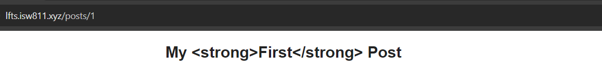
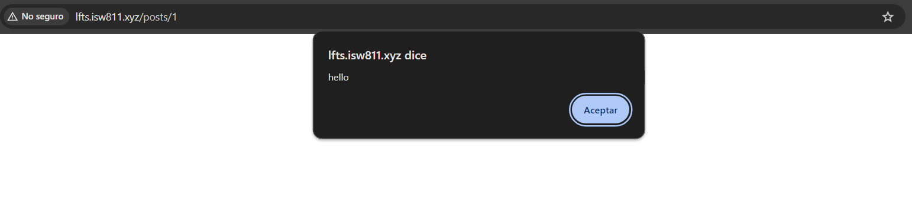

[< Volver al índice](/docs/readme.md)

# Eloquent Updates and HTML Escaping

Primero, elaboraremos las actualizaciones a los posts registrados en la base de datos utilizando modelos Eloquent y veremos la importancia de escapar el contenido para garantizar la seguridad. Todo esto mediante la herramienta Tinker que nos provee Laravel.

## Actualizar los blogs existentes

Al ingresar a la vista de un `post` existente, podemos apreciar que se ha perdido el interlineado y el margen aplicado, debido a que el contenido obtenido del valor `body` ya no es HTML, sino texto plano. Por lo que, vamos a actualizar los posts existentes para cambiar esto.

Inicialmente, abriremos Tinker en nuestra máquina invitada en la raíz del proyecto:

```bash
php artisan tinker
```

Consecuentemente, almacenamos el primer post en una variable y lo actualizaremos:

```php
$post = App\Models\Post::first();

$post->body = '<p>' . $post->body . '</p>'; // Concatenar las etiquetas p al texto plano
$post->title = 'My <strong>First</strong> Post'

$post->save(); // Persistir los datos
```

Una vez realizado lo anterior, el contenido del body estaría envuelto en una etiqueta `p` HTML. Posteriormente, repetimos los mismos pasos para el post 'Eloquent is amazing':

```php
$post = App\Models\Post::find(2);

$post->body = '<p>' . $post->body . '</p>'; // Concatenar las etiquetas p al texto plano

$post->save(); // Persistir los datos
```

## Contenido escapado y no escapado

Finalizadas las actualizaciones de ambos posts, podemos apreciar el título de `My First Post` de la siguiente forma:



Lo anterior se debe a que el `{{ }}` por defecto escapa su contenido por cuestiones de seguridad. Sin embargo, si se tiene el **contenido o datos a mostrar bajo control**, podemos utilizar `{{!! !!}}` para mostrar el contenido sin escapar. Por lo que realizamos el cambio necesario en la vista `post`:

```html
<x-layout>
    <article>
        <h1>{!! $post->title !!}</h1>
        // Acá
        <div>{!! $post->body !!}</div>
    </article>
    <a href="/">Go back</a>
</x-layout>
```

Ahora, el contenido se mostrará correctamente y el título internamente se compilará así:

```html
<h1>My <strong>First</strong> Post</h1>
```

### Potenciales problemas al no escapar el contenido

Es muy crucial que al utilizar `{{!! !!}}` realmente se tenga bajo control el contenido. Porque de lo contrario se podrían dar vulnerabilidades o funcionalidades no deseadas, como la inyección de scripts. Por ejemplo, utilizando Tinker realicemos lo siguiente:

```php
use App\Models\Post;

$post = Post::first();

$post->title = 'My Post  <script>alert("hello")</script>';

$post->save();
```

Cada vez que abramos el primer post, el script se ejecutará, lo cual es un comportamiento indeseado.



Por esto la importancia de escapar el contenido a mostrar, cuando no estemos seguros de su fiabilidad u origen. Por ejemplo, en la vista `post` resultaría de la siguiente manera:

```html
<x-layout>
    <article>
        <h1>{{ $post->title }}</h1>
        <div>{!! $post->body !!}</div>
    </article>
    <a href="/">Go back</a>
</x-layout>
```
