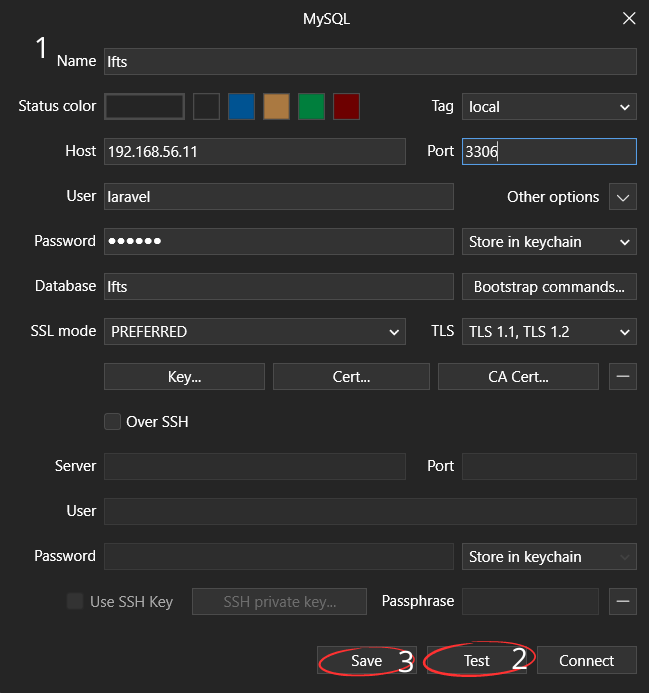

[< Volver al índice](/docs/readme.md)

# Environment Files and Database Connections

En este episodio, abordaremos la importancia de los archivos de entorno, añadiremos los parámetros necesarios para realizar la conexión a la base de datos en el `.env` del proyecto, se instalará y configurará la herramienta TablePlus, la cual nos permitirá manejar la base de datos mediante una GUI intuitiva.

## Importancia de los archivos de entorno

Los archivos de entorno `.env` se usan para almacenar datos o parámetros de configuración sensibles, como lo son los tokens, contraseñas de servicios, información de base de datos, entre otros. Estos archivos nunca se suben a ningún repositorio aumentando la seguridad y manteniendo la información confidencial de manera privada, y la aplicación accede a estos datos de manera referenciada, por ejemplo:

En el archivo `/config/database.php`, encontramos lo siguiente:

```php
'default' => env('DB_CONNECTION', 'mysql')
```

En este punto, lo que hace es obtener el valor de forma referenciada `'DB_CONNECTION'` del `.env` utilizando la función `env()`.

## Conexión a la base de datos

Para configurar la conexión a la base de datos, primero debemos ajustar los siguientes parámetros relacionados con la base de datos en el archivo `.env` del proyecto:

```yaml
DB_CONNECTION=mysql
DB_HOST=192.168.56.11
DB_PORT=3306
DB_DATABASE=lfts
DB_USERNAME=laravel
DB_PASSWORD=secret
```

**Para poder tener una conexión exitosa, debemos realizar los siguientes pasos en nuestra línea de comando en nuestra máquina invitada `webserver`:**

Inicialmente, podríamos instalar MySQL (en nuestro caso ya lo tenemos instalado) con el comando:

```bash
brew install mysql
```

Posteriormente, nos conectamos con el usuario `laravel` con el comando:

```bash
mysql -u laravel -h 192.168.56.11 -p
```

Luego creamos la base de datos con la que iremos a trabajar:

```bash
create database lfts
```

Ahora, nos salimos del cliente _MariaDB_ y ejecutamos las migraciones de Laravel para que se generen las tablas necesarias:

```bash
php artisan migrate
```

Para probar los cambios realizados, volvemos a acceder al cliente de _MariaDB_ y comprobamos las nuevas tablas con los siguientes comandos:


## Utilizar TablePlus para la GUI de MariaDB

TablePlus es una herramienta que nos facilitará la gestión de la base de datos `lfts` por medio de una intuitiva GUI. Primero es necesario llevar a cabo la instalación de TablePlus en la máquina anfitriona.

Una vez finalizada la instalación, abrimos la nueva herramienta y presionamos en el símbolo `+` y posteriormente en la opción de `MySQL`.


Después, se nos mostrará una interfaz en donde tendremos que ingresar los datos de conexión con la base de datos. Una vez insertados estos datos, presionamos en el botón `Test` y, si se muestra un mensaje que la conexión es correcta, hacemos clic en `Save`.



Finalizado los pasos anteriores, podemos ingresar a la nueva conexión `lfts` dando doble clic sobre esta y ya podríamos acceder a realizar cambios en la base de datos utilizando la GUI de TablePlus.
