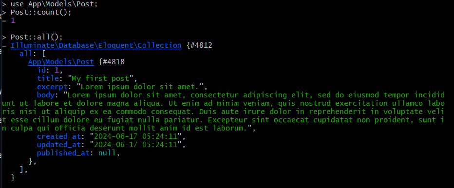
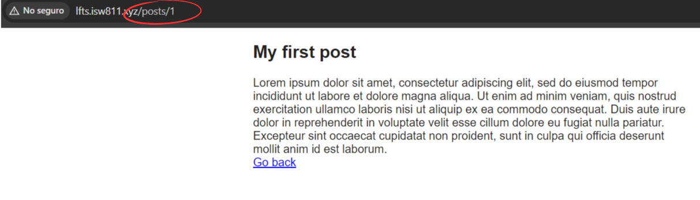

[< Volver al índice](/docs/readme.md)

# Make a Post Model and Migration

Ahora lo que realizaremos es hacer la transición del modelo `Post` basado en implementaciones a un modelo Eloquent. También, prepararemos y ejecutaremos una migración para construir la tabla `posts` en nuestra base de datos `lfts`. Por lo que, inicialmente, debemos eliminar la clase `Post.php` ubicada en `/app/Models/`.

## Migración del modelo Post

Primero, debemos generar el archivo de migración del modelo `Post` con un nombre descriptivo de lo que la migración hará. Para ello, ubicados en nuestra máquina virtual, utilizaremos el siguiente comando:

```bash
php artisan make:migration create_posts_table
```

Esto nos generará el archivo `/database/migrations/2024_06_17_045210_create_posts_table.php`, con los métodos `up()` y `down()` predefinidos.

### Solicitar ayuda al asistente de artisan

En casos en que no sabemos qué argumentos deben ir en ciertos comandos, podemos pedir ayuda de la siguiente manera:

```bash
php artisan help make:migration
```

Esto nos mostrará los argumentos y las opciones que acepta el comando.

## Eliminar directorio de posts

Dado que vamos a almacenar los posts en la base de datos, vamos a eliminar la carpeta `/resources/posts` que contiene todos los posts almacenados en archivos HTML.

## Archivo de migración para los posts

Debemos actualizar el método `up()` para que pueda añadir todas las columnas necesarias de las publicaciones. El método `up()` resultará de la siguiente manera:

```php
public function up()
{
    Schema::create('posts', function (Blueprint $table) {
        $table->id();
        $table->string('title');
        $table->text('excerpt');
        $table->text('body');
        $table->timestamps();
        $table->timestamp('published_at')->nullable();
    });
}
```

Una vez realizados los cambios anteriores, podemos ejecutar la migración:

```bash
php artisan migrate
```

Y podemos verificar que se haya creado la tabla `posts` en _TablePlus_.


## Crear modelo Eloquent para Post

Para crear el modelo Eloquent, vamos a generarlo utilizando artisan. Es muy importante darle el nombre en singular, lo contrario a la tabla que se da en plural.

```bash
php artisan make:model Post
```

El anterior comando nos generará el siguiente modelo en el directorio `/app/Models`:

```php
<?php

namespace App\Models;

use Illuminate\Database\Eloquent\Factories\HasFactory;
use Illuminate\Database\Eloquent\Model;

class Post extends Model
{
    use HasFactory;
}
```

## Jugar alrededor del nuevo modelo Post

Para probar la funcionalidad del nuevo modelo, podemos acceder a Tinker.

```bash
php artisan tinker
```

Crearemos un nuevo registro ejecutando:

```php
$post = new App\Models\Post;

$post->title = 'My first post';
$post->excerpt = 'Lorem ipsum dolor sit amet.';
$post->body = 'Lorem ipsum dolor sit amet, consectetur adipiscing elit, sed do eiusmod tempor incididunt ut labore et dolore magna aliqua. Ut enim ad minim veniam, quis nostrud exercitation ullamco laboris nisi ut aliquip ex ea commodo consequat. Duis aute irure dolor in reprehenderit in voluptate velit esse cillum dolore eu fugiat nulla pariatur. Excepteur sint occaecat cupidatat non proident, sunt in culpa qui officia deserunt mollit anim id est laborum.';
```

Lo guardaremos:

```php
$post->save();
```

Y listo, tendríamos nuestro primer post almacenado en la tabla `posts`. Se puede comprobar la inserción yéndose a _TablePlus_ y viendo la data, en donde encontraremos nuestro nuevo registro persistido.

### Utilizar métodos del modelo Eloquent

Podemos utilizar los métodos del modelo Eloquent `Post` para interactuar con los datos. Por ejemplo:



También podríamos probarlos con los demás métodos vistos en el capítulo anterior.

## Actualizar rutas

En el archivo `/routes/web.php` no hay que actualizar mucho realmente, ya que ya se tenía previamente el `use App\Models\Post;` y los métodos que se llaman en cada ruta no cambian de nombre. El único cambio necesario es en el endpoint `'posts/{post}'` ya no utilizaremos el slug para buscar un post, ahora es por su ID.

```php
Route::get('/', function () {
    return view('posts', [
        'posts' => Post::all()
    ]);
});


Route::get('posts/{post}', function ($id) {
    return view('post', [
        'post' => Post::findOrFail($id)
    ]);
});
```

Ahora, los posts se cargarán desde la base de datos.

## Actualizar vista `posts`

El único cambio necesario en la vista `posts` es que en lugar de imprimir el slug, ahora imprimiremos el id.

```html
<x-layout>
    @foreach ($posts as $post)
        <article class="{{ $loop->even ? 'mb-6' : 'foobar' }}">
            <h1>
                <a href="posts/{{ $post->id }}"> {{ $post->title }} </a>
            </h1>
            <div>{{ $post->excerpt }}</div>
        </article>
    @endforeach
</x-layout>
```

Y para este punto, podremos acceder a los posts con total normalidad.



Para finalizar, crearemos el post 'Eloquent is amazing' utilizando Tinker, siguiendo los pasos anteriores.


