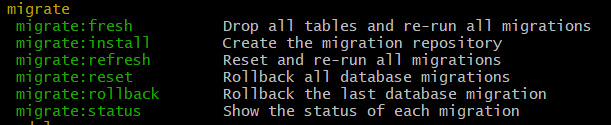

[< Volver al índice](/docs/readme.md)

# Migrations: The Absolute Basics

Para este capítulo, nos enfocaremos en entender las migraciones en Laravel. En donde evaluaremos las nuevas y misteriosas clases generadas en el proceso de migración. Además, realizaremos diferentes pruebas utilizando el comando `php artisan migrate` y variaciones.

## Examinar tabla users

Examinando la tabla `users` podemos ver que esta tiene definida una serie de columnas con distintas características, creadas a partir del proceso de migración.


Esta tabla fue creada a partir del archivo de migración `2014_10_12_000000_create_users_table.php`, el cual podemos encontrar en la dirección `/database/migrations/`. Este archivo de migración lo podemos encontrar dividido en dos métodos:

-   `up()`: es para correr la migración.
-   `down()`: es para revertir la migración.

## Manejar migraciones

En el archivo `2014_10_12_000000_create_users_table.php` vamos a modificar la función `up()` de la siguiente forma:

```php
public function up()
{
    Schema::create('users', function (Blueprint $table) {
        $table->id();
        $table->string('name');
        $table->string('email')->unique();
        $table->timestamp('email_verified_at')->nullable();
        $table->string('password');
        $table->rememberToken();
        $table->timestamps();
    });
}
```

Ahora, con el asistente en comandos de artisan, ejecutamos `php artisan` y buscamos la sección _migrate_. Esta nos mostrará todas las opciones disponibles para gestionar las migraciones.



### Realizar rollback

El método `down()` describe cómo debe revertir los cambios de la migración para volver a cómo estaba antes de realizar la última migración. Para ejecutar la funcionalidad de este método debemos realizar un rollback:

```bash
php artisan migrate:rollback
```

Al ejecutar el comando anterior, todas las tablas creadas mediante migración han ejecutado su método `down()`, eliminado las tablas creadas y únicamente quedaría la tabla migrations:


### Realizar migraciones nuevamente

Para poder aplicar las migraciones nuevamente y poder ver los cambios en la tabla `users`, ejecutamos:

```bash
php artisan migrate
```

### Modificar el batch

Si modificamos el número de batch de la migración de `users` a un número más alto en la tabla `migrations`, de la siguiente manera:


Y si volvemos a ejecutar `php artisan migrate:rollback`, únicamente se revertirá la tabla `users`. Sin embargo, esto solo fue para ver su comportamiento, así que restauramos la tabla `users` ejecutando `php artisan migrate`.

### Usar `artisan:fresh`

Para eliminar todas las tablas y volver a generar las migraciones desde cero, podemos ejecutar la orden:

```bash
php artisan migrate:fresh
```

Este comando elimina todos los datos, por lo que nunca se debe de ejecutarse en un entorno de producción. Por ejemplo, si cambias la variable `APP_ENV` a 'production' del archivo `.env`, al intentar ejecutar este comando te muestra una advertencia y te pedirá una confirmación para poder proceder.

## Modificar archivo de migraciones de la tabla users

Ahora, adaptaremos según las necesidades de nuestro blog la tabla `users`. Para esto realizamos las modificaciones desde el archivo `/database/migrations/2014_10_12_000000_create_users_table.php`:

```php
public function up()
{
    Schema::create('users', function (Blueprint $table) {
        $table->id();
        $table->string('username');
        $table->string('email')->unique();
        $table->string('password');
        $table->boolean('is_admin')->default(false);
        $table->rememberToken();
        $table->timestamps();
    });
}
```

Y para que los cambios se hagan efectivos, volvemos a ejecutar:

```bash
php artisan migrate:rollback
php artisan migrate:fresh
```

Y si nos vamos a _TablePlus_, podríamos ver los cambios implementados:


Por último, añadimos una nueva fila con nuestra información, lo cual podemos hacerlo utilizando la GUI de _TablePlus_ o ingresando al editor SQL y ejecutando el siguiente comando SQL:

```sql
INSERT INTO `users` (`id`, `username`, `email`, `password`, `is_admin`, `remember_token`, `created_at`, `updated_at`) VALUES
(2, 'Cristopher', 'cristopheralvarado101@gmail.com', 'contraseña-hash', 0, NULL, NULL, NULL);
```
