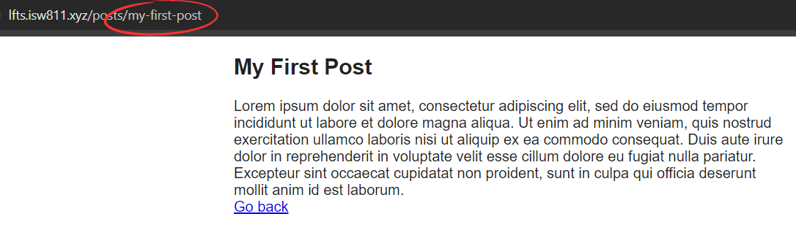

[< Volver al índice](/docs/readme.md)

# Route Model Binding

En esta ocasión, se vinculará un wildcard de ruta a una instancia del modelo Eloquent `Post`, por medio de la funcionalidad de route model binding de Laravel.

## Implementar route model binding

Para utilizar esta funcionalidad, nos dirigimos al archivo `/routes/web.php` y actualizamos el endpoint `'posts/{post}'`, de la siguiente manera:

```php
Route::get('posts/{post}', function (Post $post) {
    return view('post', [
        'post' => $post
    ]);
});
```

Y listo, ya busca los posts por su respectivo `id`.

### ¿Cómo funciona?

Este funcionamiento lo que hace es vincular una clave de ruta a un modelo eloquent subyacente. Básicamente lo que hace es sobreentender `Route::get('posts/{post}', function (Post $post)` cuando el nombre del wildcard (comodín) y el tipo de variable coinciden, entonces Laravel automáticamente busca el post solicitado.

### Aspecto a tener en cuenta

1. El nombre del wildcard tiene que coincidir con el nombre de la variable. Por ejemplo, lo siguiente no funcionaría:

    ```php
    Route::get('posts/{post}', function (Post $foo) {
        return view('post', [
            'post' => $foo
        ]);
    });
    ```

## Cambios en la tabla posts

Modificamos el archivo `2024_06_17_045210_create_posts_table.php` para añadir una nueva columna `slug`:

```php
public function up()
{
    Schema::create('posts', function (Blueprint $table) {
        $table->id();
        $table->string('title');
        $table->string('slug')->unique();
        $table->text('excerpt');
        $table->text('body');
        $table->timestamps();
        $table->timestamp('published_at')->nullable();
    });
}
```

En nuestra máquina virtual, en la raíz del proyecto, refrescamos las migraciones desde cero:

```bash
php artisan migrate:fresh
```

Y volvemos a insertar los posts, pero ahora con el espacio slug. Por ejemplo:

```SQL
INSERT INTO `posts` (`id`, `title`, `slug`, `excerpt`, `body`, `created_at`, `updated_at`, `published_at`) VALUES
(1, 'My First Post', 'my-first-post', 'excerpt of post', 'Lorem ipsum dolor sit amet, consectetur adipiscing...', NULL, NULL, NULL);
```

### Utilizar Slug para la búsqueda

Para poder buscar los posts por `slug` utilizando route model blinding, lo podríamos hacer de la siguiente manera:

```php
Route::get('posts/{post:slug}', function (Post $post) {
    return view('post', [
        'post' => $post
    ]);
});
```

Lo cual se traduciría a algo similar como `Post::where('slug', $post)->firstOrFail();`. Para que este funcione, ajustamos lo siguiente en la vista `posts.blade.php`:

```html
<h1>
    <a href="posts/{{ $post->slug }}"> {!! $post->title !!} </a>
</h1>
```

Y si lo probamos, podríamos comprobar que ahora la búsqueda es por `Slug`.



### Utilizar slug para la búsqueda con el método `getRouteKeyName`

En caso de que quisiéramos realizar la búsqueda por medio `slug` y no lo especifiquemos en la ruta `'posts/{post}'`. Podríamos añadir el siguiente método al modelo `Post`:

```php
public function getRouteKeyName()
{
    return 'slug';
}
```

Añadiendo esto, se le indica a Laravel que busque por `slug` en lugar de por `id`. En versiones anteriores, así era como se trabaja el route model binding.
