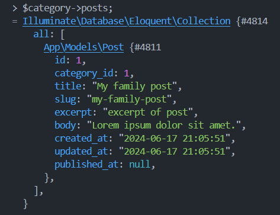
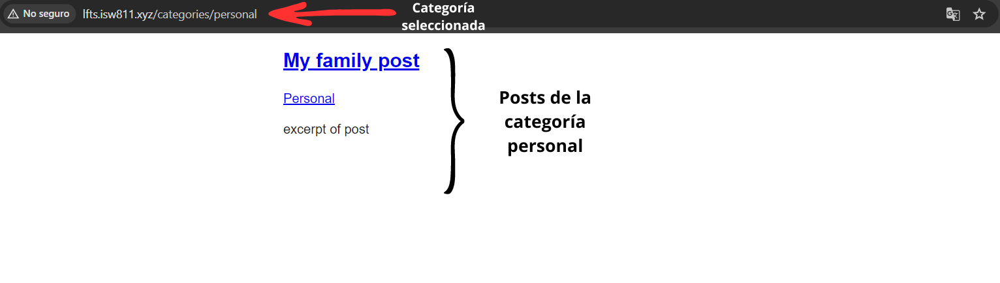

[< Volver al índice](/docs/readme.md)

# Show All Posts Associated With a Category

En este episodio, crearemos una nueva ruta que buscará y cargará todos los posts asociados con una categoría dada. Esto nos permitirá acceder a las categorías y poder ver los posts que hay relacionados con ellas.

## Agregar nuevo endpoint `'categories/{category}'`

En el archivo `/routes/web.php`, añadiremos este nuevo endpoint:

```php
Route::get('categories/{category:slug}', function (Category $category) {
    return view('posts', [
        'posts' => $category->posts
    ]);
});
```

Este endpoint utilizando el route model binding nos permitirá obtener todos los posts de una categoría en específico mediante su `slug`.

## Nueva relación eloquent en el modelo `Category`

Para que el endpoint creado con anterioridad funcione, debemos añadir el siguiente método al archivo del modelo eloquent `Category`:

```php
public function posts()
{
    return $this->hasMany(Post::class);
}
```

Este método define la relación que hay entre categorías y posts (una categoría puede tener muchos posts). Esto lo podríamos probar con la herramienta Tinker, de la siguiente manera:



## Actualizar vistas

Para permitir seleccionar y ver los posts por categorías, debemos modificar en las vistas las etiquetas `a` de categorías para que apunten hacia el nuevo endpoint enviándole el `slug` de la categoría específica.

Actualizamos la vista `posts.blade.php`:

```html
<x-layout>
    @foreach ($posts as $post)
    <article class="{{ $loop->even ? 'mb-6' : 'foobar' }}">
        <h1>
            <a href="posts/{{ $post->slug }}"> {!! $post->title !!} </a>
        </h1>
        <p>
            <!-- Modificación acá: -->
            <a href="/categories/{{ $post->category->slug }}">
                {{ $post->category->name }}
            </a>
        </p>

        <div>{{ $post->excerpt }}</div>
    </article>
    @endforeach
</x-layout>
```

Actualizamos la vista `post.blade.php`:

```html
<x-layout>
    <article>
        <h1>{{ $post->title }}</h1>
        <p>
            <!-- Modificación acá: -->
            <a href="/categories/{{ $post->category->slug }}">
                {{ $post->category->name }}
            </a>
        </p>
        <div>{!! $post->body !!}</div>
    </article>
    <a href="/">Go back</a>
</x-layout>
```

Al dar clic en una categoría e ingresar, podríamos ver algo similar a lo siguiente:

