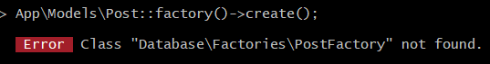
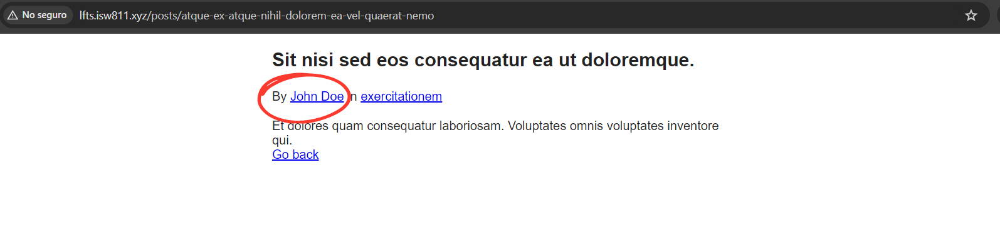

[< Volver al índice](/docs/readme.md)

# Turbo Boost With Factories

Actualmente, gracias al episodio anterior logramos entender la funcionalidad y aspectos básicos del database seeding. Por esto, en el transcurso de esta lección integraremos model factories para generar la cantidad de datos falsos que necesitemos, sin tener el problema de tener que definirlos manualmente y adaptaremos el archivo `/database/seeders/DatabaseSeeder.php` para que utilice las nuevas factories.

Por ejemplo, si quisiéramos crear un usuario con datos falsos de manera automática, podríamos ejecutar el siguiente comando en Tinker:

```php
App\Models\User::factory()->create();
```

O si quisiéramos crear 50 usuarios con información falsa:

```php
App\Models\User::factory(50)->create();
```

Pero si intentamos crear posts con datos falsos, nos mostrará un error:



Este se debe a que no existe un archivo factory que se haya configurado para cumplir con esta funcionalidad. Para poder implementar un archivo factory, es muy importante que el modelo Eloquent `Post` posea lo siguiente:

```php
class Post extends Model
{
    use HasFactory;
    ...
}
```

Esto nos permitirá aplicar una fábrica al modelo y por convención tendremos acceso con `Post::factory();`.

## Crear factory para el modelo `Post`

Para crear un archivo factory, ejecutamos:

```bash
php artisan make:factory PostFactory
```

Este nuevo archivo se crea en el directorio `/database/factories/`. Ahora, es necesario modificar el nuevo archivo `PostFactory.php`, por lo que realizamos lo siguiente:

```php
class PostFactory extends Factory
{
    public function definition()
    {
        return [
            'user_id' => User::factory(),
            'category_id' => Category::factory(),
            'title' => $this->faker->sentence,
            'slug' => $this->faker->slug,
            'excerpt' => $this->faker->sentence,
            'body' => $this->faker->paragraph,
        ];
    }
}
```

Con cambios, nos permitirán realizar tres importantes puntos al utilizar el `PostFactory`: poder rellenar con información genérica las columnas `title`, `excerpt` y `body`, se creará un usuario y asignaremos su `id` a la columna `user_id` y se creará una categoría y asignaremos su `id` a la columna `category_id`.

## Crear factory para el modelo `Category`

Antes de poder hacer uso del factory de `Post` debemos generar el factory `Category`, para esto realizamos lo siguiente:

Creamos un archivo factory ejecutando:

```bash
php artisan make:factory CategoryFactory
```

Modificamos el archivo `/database/factories/CategoryFactory.php`:

```php
class CategoryFactory extends Factory
{
    public function definition()
    {
        return [
            'name' => $this->faker->word,
            'slug' => $this->faker->slug
        ];
    }
}
```

## Probar factory post

Para probar el factory `Post`, podemos ingresar a Tinker y ejecutar lo siguiente:

```php
App\Models\Post::factory()->create();
```

Ahora, sí funcionará y una ventaja de hacerlo de esta manera es que crea las publicaciones con sus respectivas relaciones a `users` y `categories`.

## Refactorizar seeder `DatabaseSeeder.php`

Con todos los pasos anteriores, podremos modificar el archivo `/database/seeders/DatabaseSeeder.php` y utilizar el factory de `Post`, lo cual nos resultará en un código más limpio:

```php
class DatabaseSeeder extends Seeder
{
    public function run()
    {
        Post::factory(5)->create();
    }
}
```

Estas modificaciones elaboradas se hicieron con el fin de utilizar los seeders únicamente cuando refresquemos nuestra base de datos con el siguiente comando:

```bash
php artisan migrate:fresh --seed
```

### Generar información a excepto una columna

Si se desea generar únicamente un usuario y darle su nombre, pero que la demás información se rellene automáticamente, podríamos realizar lo siguiente en el archivo `DatabaseSeeder.php`:

```php
public function run()
{
    $user = User::factory()->create([
        'name' => 'John Doe'
    ]);

    Post::factory()->create([
        'user_id' => $user->id
    ]);
}
```

Esto generaría datos falsos para todas las columnas excepto el nombre, y todos los posts estarían asociados a este usuario. Para este punto. Ahora, tendremos un seeder configurado para que nos brinde datos falsos automáticamente cada vez que reiniciemos las tablas. Por ejemplo, al acceder a un post en especifico, podríamos verlo algo como esto:


