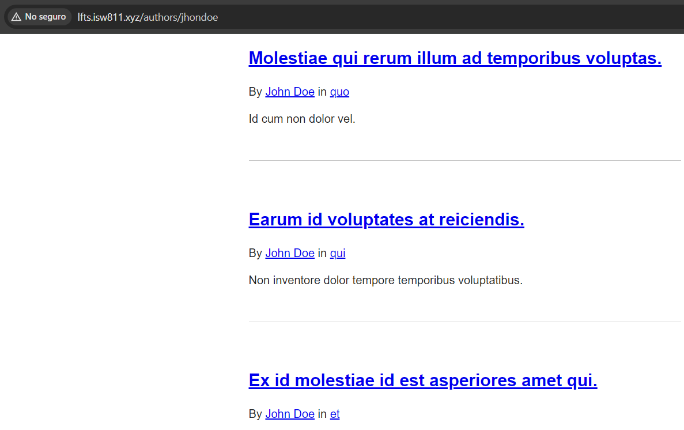

[< Volver al índice](/docs/readme.md)

# View All Posts By An Author

En esta ocasión, ahora que podemos asociar un post con un autor, crearemos una nueva ruta para cargar todas las publicaciones que pertenezcan a un autor o usuario en particular.

## Cambios generales

### Endpoint `/`

Actualmente, los posts se cargan del más antiguo al más nuevo, por lo que modificaremos el endpoint de donde se cargan. Para cargar de los posts más recientes a los más antiguos, la ruta `/` del archivo `web.php` resultaría de la siguiente forma:

```php
Route::get('/', function () {
    return view('posts', [
        'posts' => Post::latest('published_at')->with('category')->get()
    ]);
});
```

### Vista `post.blade.php` y modelo `Post`

El código debe reflejar la forma en la que habla y en la vista `post.blade.php`, la referencia a `{{ $post->user->name }}` puede ser algo confusa. Por ello, la cambiamos a lo siguiente:

```html
<p>
    By
    <a href="authors/{{ $post->author->id }}">{{ $post->author->name }}</a> in
    <a href="/categories/{{ $post->category->slug }}">
        {{ $post->category->name }}
    </a>
</p>
```

Para que lo anterior funcione y no nos dé el error 'Attempt to read property "name" on null'. Debemos refactorizar el método `user()`, resultando en algo como esto:

```php
public function author()
{
    return $this->belongsTo(User::class, 'user_id');
}
```

Lo que hicimos fue cambiar el nombre del método a `author` e indicarle el nombre de la llave foránea.

### Vista `posts.blade.php`

Modificamos la vista `posts.blade.php` para que pueda mostrar su author al igual que en la vista `post`:

```php
<x-layout>
    @foreach ($posts as $post)
    <article class="{{ $loop->even ? 'mb-6' : 'foobar' }}">
        <h1>
            <a href="posts/{{ $post->slug }}">
                {!! $post->title !!}
            </a>
        </h1>
        <p>
            By <a href="authors/{{ $post->author->id }}">{{ $post->author->name }}</a> in
            <a href="/categories/{{ $post->category->slug }}">
                {{ $post->category->name }}
            </a>
        </p>

        <div>
            {{ $post->excerpt }}
        </div>
    </article>
    @endforeach
</x-layout>
```

Debemos tener en cuenta el problema N+1. Para controlar esto, en este caso en el archivo `web.php` ajustamos el siguiente endpoint:

```php
Route::get('/', function () {
    return view('posts', [
        'posts' => Post::latest()->with(['category', 'author'])->get()
    ]);
});
```

## Crear ruta para autores

Ahora, crearemos la ruta para cargar los posts por autores, así que en el archivo `web.php` añadiremos la siguiente ruta:

```php
Route::get('authors/{author}', function (User $author) {
    return view('posts', [
        'posts' => $author->posts
    ]);
});
```

Ahora, al seleccionar algún autor podemos ver todos los posts que le pertenecen a ese autor en específico.

## Problema con la URI

El único problema actualmente es que cuando se selecciona un autor, la URI muestra algo similar a esto: `http://lfts.isw811.xyz/authors/1`. Lo anterior es aceptable, más no deseable, por esto cambiaremos la búsqueda por el `username`, en lugar de por `id`. Para ello, realizamos los pasos presentados a continuación.

Cambiar el archivo de migración `2014_10_12_000000_create_users_table.php` y le añadimos un valor para una nueva columna `username`.

```php
public function up()
{
    Schema::create('users', function (Blueprint $table) {
        $table->id();
        $table->string('username')->unique();
        $table->string('name');
        $table->string('email')->unique();
        $table->timestamp('email_verified_at')->nullable();
        $table->string('password');
        $table->rememberToken();
        $table->timestamps();
    });
}
```

Modificamos el archivo factory `/database/factories/UserFactory.php`, específicamente su método `definition()` para añadir el cambio anterior.

```php
public function definition()
{
    return [
        'name' => $this->faker->name(),
        'username' => $this->faker->unique()->userName(),
        'email' => $this->faker->unique()->safeEmail(),
        'email_verified_at' => now(),
        'password' => '$2y$10$92IXUNpkjO0rOQ5byMi.Ye4oKoEa3Ro9llC/.og/at2.uheWG/igi', // password
        'remember_token' => Str::random(10),
    ];
}
```

Una vez realizados los cambios anteriores, actualizamos nuestra migración con:

```bash
php artisan migrate:fresh --seed
```

Actualizamos la siguiente etiqueta HTML tanto en la vista `posts` como en la vista `post`:

```html
<p>
    By
    <a href="authors/{{ $post->author->username }}">
        {{ $post->author->name }}</a
    >
    in
    <a href="/categories/{{ $post->category->slug }}">
        {{ $post->category->name }}
    </a>
</p>
```

Por último, modificamos el endpoint para que en el wildcard haga la referencia a `username`:

```php
Route::get('authors/{author:username}', function (User $author) {
    return view('posts', [
        'posts' => $author->posts
    ]);
});
```

Finalizado los pasos anteriores, podremos cargar únicamente los posts asociados a un usuario en particular.


