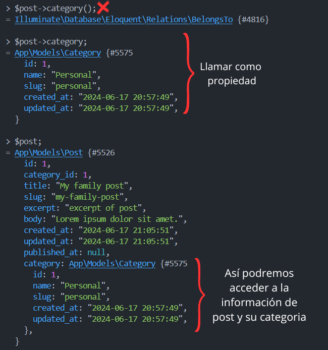

[< Volver al índice](/docs/readme.md)

# Your First Eloquent Relationship

En este capítulo crearemos un nuevo modelo Eloquent `Category` y estableceremos una relación con el modelo Eloquent `Post`, lo que nos permitirá asignar una categoría a cada post.

## Crear el modelo eloquent y archivo de migración

Ubicándonos en la máquina virtual y en la raíz de nuestro proyecto, podemos generar tanto el archivo para el modelo eloquent como el archivo de las migraciones para `Category` con el siguiente comando:

```bash
php artisan make:model Category -m
```

El parámetro `-m` es el que nos permite crear ambos archivos al ejecutar el comando anterior. Y ahora tenemos los archivos `/app/Models/Category.php` y `/database/migrations/2024_06_17_204405_create_categories_table.php`.

## Definir las migraciones

Antes de realizar la migración debemos ajustar la función `up()` del archivo de migración de categorías. Para esto le añadimos lo siguiente:

```php
public function up()
{
    Schema::create('categories', function (Blueprint $table) {
        $table->id();
        $table->string('name');
        $table->string('slug');
        $table->timestamps();
    });
}
```

Y en el archivo de migración de posts, añadimos una llave foránea necesaria para representar la relación entre los posts y su categoría respectiva:

```php
public function up()
{
    Schema::create('posts', function (Blueprint $table) {
        $table->id();
        $table->foreignId('category_id');
        $table->string('title');
        $table->string('slug')->unique();
        $table->text('excerpt');
        $table->text('body');
        $table->timestamps();
        $table->timestamp('published_at')->nullable();
    });
}
```

Y ejecutamos la migración, refrescando las tablas desde cero.

```bash
php artisan migrate:fresh
```

## Crear nuevas categorías y posts relacionados

Accedemos a Tinker con:

```bash
php artisan migrate:fresh
```

Creamos las categorías 'Personal', 'Work' y 'Hobbies', por ejemplo:

```php
use App\Models\Category;

$c->name = 'Personal';
$c->slug = 'personal';
$c->save();
```

Y creamos los siguientes posts con la columna `category_id`, la cual permitirá establecer la relación.

**Primer post:**

```php
Post::create(['title' => 'My family post', 'excerpt' => 'excerpt of post', 'body' => 'Lorem ipsum dolor sit amet.', 'slug' => 'my-family-post', 'category_id' => 1]);
```

**Segundo post:**

```php
Post::create(['title' => 'My Work post', 'excerpt' => 'excerpt of post', 'body' => 'Lorem ipsum dolor sit amet.', 'slug' => 'my-work-post', 'category_id' => 2]);
```

**Tercer post:**

```php
Post::create(['title' => 'My Hobby post', 'excerpt' => 'excerpt of post', 'body' => 'Lorem ipsum dolor sit amet.', 'slug' => 'my-hobby-post', 'category_id' => 3]);
```

Y ahora podríamos filtrar nuestros posts con el siguiente comando MySQL:

```sql
select * from posts where category_id = 1; /*id de la categoría*/
```

## Crear relaciones en modelos eloquent

Finalmente, para poder relacionar los modelos eloquent `Post` y `Category`, añadimos la siguiente función al archivo `/app/Models/Post.php`:

```php
public function Category()
{
    // hasOne, hasMany, belongsTo, belongsToMany
    return $this->belongsTo(Category::class);
}
```

Al probar esta nueva funcionalidad, debemos tener en cuenta que `category` se debe acceder como propiedad. Por ejemplo:



## Actualizar vistas para que se muestren las categorías

Actualizamos la vista `/resources/views/posts.blade.php`:

```html
<x-layout>
    @foreach ($posts as $post)
    <article class="{{ $loop->even ? 'mb-6' : 'foobar' }}">
        <h1>
            <a href="posts/{{ $post->slug }}"> {!! $post->title !!} </a>
        </h1>
        <p>
            <a href="#">{{ $post->category->name }}</a>
        </p>
        <div>{{ $post->excerpt }}</div>
    </article>
    @endforeach
</x-layout>
```

Actualizamos la vista `/resources/views/post.blade.php`:

```html
<x-layout>
    <article>
        <h1>{{ $post->title }}</h1>
        <p>
            <a href="#">{{ $post->category->name }}</a>
        </p>
        <div>{!! $post->body !!}</div>
    </article>
    <a href="/">Go back</a>
</x-layout>
```

Ahora, en cada vista podremos apreciar las categorías de cada post.
